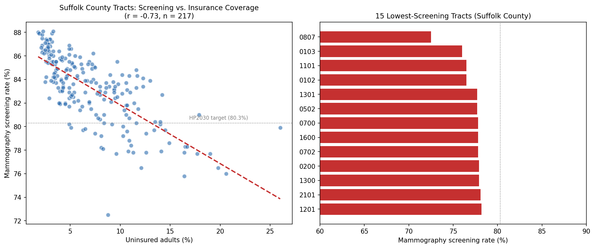

# Preventive Screening Gap Analysis: Mammography Access in Suffolk County, MA

## Research Question
Within Suffolk County (Boston), which census tracts fall below the national screening target for mammography, and how strongly does lack of health insurance track with those gaps?

## Data Source
CDC PLACES: Local Data for Better Health, Census Tract Data, 2025 release (model-based estimates from BRFSS survey data, 2022-2023).
- Measure 1: Mammography use among women aged 50-74 (crude prevalence)
- Measure 2: Current lack of health insurance among adults aged 18-64 (crude prevalence)
- Geography: 222 census tracts in Suffolk County, MA

## Cleaning Decisions
- Excluded 5 tracts with total population under 500 (largely non-residential areas — harbor islands, airport, industrial zones). PLACES model-based estimates are unstable for very small populations, and one of these tiny tracts (population 113) was producing the single lowest mammography estimate in the dataset (69.8%), which would have distorted the analysis.
- Final analytic dataset: **217 census tracts**.
- Benchmark used: Healthy People 2030 national target of **80.3%** mammography screening among women 50-74 (U.S. Preventive Services Task Force-aligned target, most recently revised 2023).

## Key Findings

1. **35 of 217 tracts (16%) fall below the national 80.3% screening target.**
2. **Screening rates vary far more within the county than the county-level average suggests.** The county-wide figure is 85.4%, but individual tracts range from 72.5% to 88.1% — a 15.6-point spread hidden by the county average.
3. **Lack of insurance is strongly associated with lower screening rates.** Pearson correlation between uninsured rate and mammography rate: **r = -0.73** (p < .0001, n = 217) — a strong, statistically significant negative relationship.
4. **Tracts below the screening target have more than double the uninsured rate** of tracts meeting the target (12.4% uninsured vs. 5.9% uninsured, on average).

## Interpretation
The relationship is strong but not deterministic — some low-insurance tracts still screen well, and a few well-insured tracts underperform, meaning insurance access is a major but not sole driver. This matters for outreach design: insurance-linked interventions (enrollment assistance, patient navigators) would likely help the majority of underperforming tracts, but a purely insurance-focused campaign would miss tracts where the barrier is something else (transportation, scheduling, awareness, trust in the healthcare system).

## Proposed Outreach Approach
1. **Prioritize the 35 below-target tracts**, ranked by a combination of screening deficit and population size (to maximize people reached per outreach dollar).
2. **Pair mobile mammography units or extended-hours screening events with on-site insurance enrollment assistance** in the highest-uninsured, lowest-screening tracts — addressing both barriers in one visit.
3. **For below-target tracts with low uninsured rates** (where insurance isn't the driver), use a different lever: patient navigator outreach, reminder calls/mailers, and community health worker engagement to address awareness or logistics barriers.
4. **Track progress by re-pulling this same PLACES measure next release cycle** to see whether targeted tracts move toward the 80.3% benchmark.

## Limitations
- PLACES data are modeled small-area estimates from survey data, not direct counts — they carry margins of error (visible in the confidence interval columns of the dataset) and should be read as estimates, not precise counts.
- Correlation does not establish causation — insurance status and screening behavior may both be driven by shared underlying factors (income, primary care access, neighborhood healthcare infrastructure).
- Data reflect 2022-2023 survey years; local conditions may have shifted since.

---

## Resume Bullet
Analyzed CDC PLACES census-tract data (n=217) for Suffolk County, MA to identify preventive care gaps; found a strong association (r=-0.73) between uninsured rates and below-target mammography screening, and proposed a targeted outreach strategy pairing insurance enrollment with mobile screening access.

## LinkedIn Post Draft
I built a population health analysis using CDC PLACES data to find where breast cancer screening access is falling short in Boston.

The county-level number for Suffolk County looks fine — 85.4% of eligible women screened, close to the national target. But that average hides a lot: at the census-tract level, screening rates range from 72.5% to 88.1%, and 35 of 217 tracts fall below the national Healthy People 2030 benchmark of 80.3%.

The strongest signal in the data: tracts with more uninsured residents have meaningfully lower screening rates (r = -0.73). Tracts below target have more than double the uninsured rate of tracts meeting it.

This is the kind of gap a Population Health Coordinator role exists to close — and it points to a concrete intervention: pairing mobile mammography access with on-site insurance enrollment help in the neighborhoods that need both.

Bringing my background as a behavioral therapist and pharmacy technician into population-level data work like this has been a great next step as I move into health informatics.
